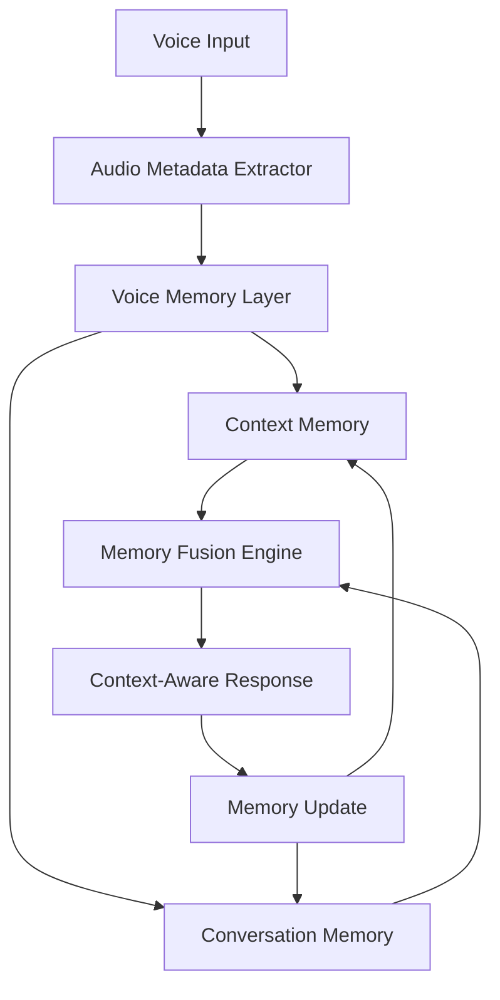

# Memory System Implementation Plan
## Voice-Enabled Conversation & Context Memory for Whisper Transcribe Pro

### Executive Summary
This plan details the implementation of a sophisticated memory system that combines conversation history, visual context, and voice-specific metadata to create an intelligent, context-aware voice assistant. The system will extract and enhance components from the AI Assistant Project while adding voice-specific capabilities.

---

## 1. Current Memory Architecture Analysis

### 1.1 Existing Components in AI Assistant Project

#### Context Memory (`core/context_memory.py`)
- **Storage**: JSON-based file persistence
- **Features**: 
  - Conversation history (50 turn limit)
  - Visual context tracking
  - User preferences
  - Scene change detection
- **Strengths**: Lightweight, fast access, simple integration
- **Limitations**: No search, limited scalability, no voice metadata

#### Conversation Memory (`src/memory/conversation_memory.py`)
- **Storage**: SQLite with FTS5 full-text search
- **Features**:
  - Session management with UUIDs
  - Agent performance tracking
  - Context snippets storage
  - Automatic cleanup
- **Strengths**: Searchable, scalable, robust
- **Limitations**: No voice-specific fields, no audio correlation

### 1.2 Voice-Specific Requirements

| Requirement | Current State | Needed Enhancement |
|------------|--------------|-------------------|
| Audio file tracking | Not present | Add audio_file_path field |
| Transcription confidence | Not tracked | Add confidence scores |
| Wake word detection | Basic implementation | Enhanced tracking & learning |
| Voice patterns | Not analyzed | Pattern recognition system |
| Command correlation | Limited | Full voice-response chains |
| Noise handling | Not considered | Noise level tracking |
| Speaker identification | Not present | Voice fingerprinting |

---

## 2. Enhanced Memory System Architecture

### 2.1 Component Overview



### 2.2 Database Schema Extensions

#### Voice-Enhanced Conversations Table
```sql
CREATE TABLE voice_conversations (
    id INTEGER PRIMARY KEY AUTOINCREMENT,
    timestamp DATETIME DEFAULT CURRENT_TIMESTAMP,
    session_id TEXT NOT NULL,
    
    -- Standard conversation fields
    user_input TEXT NOT NULL,
    assistant_response TEXT NOT NULL,
    
    -- Voice-specific fields
    audio_file_path TEXT,
    transcription_confidence REAL,
    transcription_engine TEXT,
    wake_word_used TEXT,
    voice_duration REAL,
    silence_duration REAL,
    
    -- Audio characteristics
    noise_level TEXT CHECK(noise_level IN ('low', 'medium', 'high')),
    audio_quality TEXT CHECK(audio_quality IN ('poor', 'fair', 'good', 'excellent')),
    
    -- Processing metadata
    processing_time_ms INTEGER,
    processing_breakdown JSON,
    
    -- Command execution
    command_type TEXT,
    command_success BOOLEAN,
    tool_used TEXT,
    
    -- Context references
    previous_command_id INTEGER,
    visual_context_id INTEGER,
    
    FOREIGN KEY (session_id) REFERENCES sessions(id),
    FOREIGN KEY (previous_command_id) REFERENCES voice_conversations(id)
);

-- Create indexes for performance
CREATE INDEX idx_voice_session ON voice_conversations(session_id);
CREATE INDEX idx_voice_timestamp ON voice_conversations(timestamp);
CREATE INDEX idx_voice_command_type ON voice_conversations(command_type);
```

#### Voice Sessions Table
```sql
CREATE TABLE voice_sessions (
    session_id TEXT PRIMARY KEY,
    start_time DATETIME DEFAULT CURRENT_TIMESTAMP,
    end_time DATETIME,
    
    -- Voice statistics
    total_commands INTEGER DEFAULT 0,
    successful_commands INTEGER DEFAULT 0,
    failed_commands INTEGER DEFAULT 0,
    
    -- Transcription metrics
    total_transcriptions INTEGER DEFAULT 0,
    avg_confidence REAL DEFAULT 0.0,
    min_confidence REAL,
    max_confidence REAL,
    
    -- Audio metrics
    total_voice_duration REAL DEFAULT 0.0,
    avg_noise_level TEXT,
    
    -- Wake word statistics
    wake_word_activations INTEGER DEFAULT 0,
    false_activations INTEGER DEFAULT 0,
    preferred_wake_word TEXT,
    
    -- User patterns
    command_patterns JSON,
    time_of_day_usage JSON,
    
    FOREIGN KEY (session_id) REFERENCES sessions(id)
);
```

#### Voice Context Snippets Table
```sql
CREATE TABLE voice_context_snippets (
    id INTEGER PRIMARY KEY AUTOINCREMENT,
    session_id TEXT NOT NULL,
    timestamp DATETIME DEFAULT CURRENT_TIMESTAMP,
    
    -- Snippet information
    snippet_type TEXT NOT NULL,
    content TEXT NOT NULL,
    importance REAL DEFAULT 0.5,
    
    -- Voice correlation
    related_command_id INTEGER,
    audio_context JSON,
    
    -- Expiration
    expires_at DATETIME,
    
    FOREIGN KEY (session_id) REFERENCES sessions(id),
    FOREIGN KEY (related_command_id) REFERENCES voice_conversations(id)
);
```

---

## 3. Implementation Classes

### 3.1 Core Memory Classes

#### VoiceMemoryManager
```python
class VoiceMemoryManager:
    """Central manager for all memory operations"""
    
    def __init__(self, config: Dict[str, Any]):
        self.config = config
        self.conversation_memory = VoiceConversationMemory(config)
        self.context_memory = VoiceContextMemory(config)
        self.pattern_analyzer = VoicePatternAnalyzer()
        self.memory_fusion = MemoryFusionEngine()
        
    async def process_voice_command(self, 
                                   transcription: str,
                                   audio_metadata: Dict) -> Dict:
        """Process voice command with full memory integration"""
        
        # Get relevant context
        context = await self.get_relevant_context(transcription)
        
        # Analyze patterns
        patterns = self.pattern_analyzer.analyze(transcription, context)
        
        # Store command
        command_id = await self.store_voice_command(
            transcription, audio_metadata, context, patterns
        )
        
        return {
            'command_id': command_id,
            'context': context,
            'patterns': patterns
        }
    
    async def store_response(self, 
                            command_id: int,
                            response: str,
                            execution_metadata: Dict):
        """Store assistant response with execution metadata"""
```

#### VoiceConversationMemory
```python
class VoiceConversationMemory:
    """SQLite-based conversation memory with voice enhancements"""
    
    def __init__(self, config: Dict[str, Any]):
        self.db_path = config.get('db_path', '~/.whisper_voice_memory.db')
        self.max_history = config.get('max_history', 100)
        self._init_database()
        
    def _init_database(self):
        """Initialize database with voice-enhanced schema"""
        
    async def add_voice_conversation(self,
                                    user_input: str,
                                    assistant_response: str,
                                    audio_metadata: Dict,
                                    execution_metadata: Dict) -> int:
        """Add voice conversation with full metadata"""
        
    async def search_conversations(self,
                                  query: str,
                                  filters: Dict = None) -> List[Dict]:
        """Full-text search with voice-specific filters"""
        
    def get_voice_statistics(self, 
                            session_id: str = None,
                            days: int = 7) -> Dict:
        """Get comprehensive voice usage statistics"""
        
    def analyze_command_patterns(self,
                                user_id: str = None) -> Dict:
        """Analyze voice command patterns for optimization"""
```

#### VoiceContextMemory
```python
class VoiceContextMemory:
    """JSON-based context memory with voice enhancements"""
    
    def __init__(self, config: Dict[str, Any]):
        self.memory_dir = Path(config.get('memory_dir', './memory'))
        self.context_window = config.get('context_window', 10)
        self.voice_context = {
            'recent_commands': [],
            'wake_word_stats': {},
            'user_patterns': {},
            'scene_context': {},
            'preferences': {}
        }
        
    def add_voice_context(self,
                         command: str,
                         confidence: float,
                         wake_word: str,
                         scene_data: Dict = None):
        """Add voice interaction to context"""
        
    def get_relevant_context(self,
                            new_command: str,
                            max_items: int = 5) -> Dict:
        """Get context relevant to new command"""
        
    def update_user_patterns(self,
                            pattern_type: str,
                            pattern_data: Dict):
        """Update learned user patterns"""
```

### 3.2 Pattern Analysis Classes

#### VoicePatternAnalyzer
```python
class VoicePatternAnalyzer:
    """Analyze and learn from voice command patterns"""
    
    def __init__(self):
        self.command_clusters = {}
        self.phrase_frequencies = {}
        self.time_patterns = {}
        
    def analyze(self,
               command: str,
               context: Dict) -> Dict:
        """Analyze command for patterns"""
        
        patterns = {
            'command_type': self._classify_command(command),
            'complexity': self._assess_complexity(command),
            'similarity_to_previous': self._find_similar_commands(command, context),
            'predicted_intent': self._predict_intent(command, context),
            'suggested_responses': self._suggest_responses(command, context)
        }
        
        return patterns
    
    def learn_from_outcome(self,
                          command: str,
                          response: str,
                          success: bool,
                          user_feedback: str = None):
        """Learn from command execution outcome"""
        
    def predict_next_command(self,
                            context: Dict,
                            partial_input: str = None) -> List[str]:
        """Predict likely next commands"""
```

#### MemoryFusionEngine
```python
class MemoryFusionEngine:
    """Fuse different memory types for comprehensive context"""
    
    def __init__(self):
        self.fusion_weights = {
            'conversation': 0.4,
            'visual': 0.3,
            'patterns': 0.2,
            'preferences': 0.1
        }
        
    async def fuse_context(self,
                          conversation_context: Dict,
                          visual_context: Dict,
                          pattern_context: Dict,
                          user_preferences: Dict) -> Dict:
        """Fuse multiple context sources"""
        
        fused = {
            'primary_context': self._extract_primary_context(
                conversation_context, self.fusion_weights['conversation']
            ),
            'scene_awareness': self._integrate_visual_context(
                visual_context, self.fusion_weights['visual']
            ),
            'behavioral_insights': self._apply_patterns(
                pattern_context, self.fusion_weights['patterns']
            ),
            'personalization': self._apply_preferences(
                user_preferences, self.fusion_weights['preferences']
            ),
            'confidence_score': self._calculate_fusion_confidence()
        }
        
        return fused
```

---

## 4. Integration with Whisper Transcribe Pro

### 4.1 Main Integration Points

#### Modified WhisperTranscribePro Class
```python
class WhisperTranscribePro:
    def __init__(self):
        # Existing initialization
        ...
        
        # Add voice memory system
        if self.settings.get('voice_memory_enabled', True):
            self.voice_memory = VoiceMemoryManager(
                self.settings.get('memory_config', {})
            )
        
    async def process_transcription_with_memory(self, 
                                               text: str,
                                               audio_file: str = None):
        """Process transcription with memory integration"""
        
        # Extract audio metadata
        audio_metadata = self.extract_audio_metadata(audio_file) if audio_file else {}
        
        # Process with memory
        memory_context = await self.voice_memory.process_voice_command(
            text, audio_metadata
        )
        
        # Check if this is a command
        if self.is_voice_command(text):
            response = await self.execute_command_with_context(text, memory_context)
        else:
            response = await self.process_conversation_with_context(text, memory_context)
        
        # Store response
        await self.voice_memory.store_response(
            memory_context['command_id'],
            response,
            {'success': True, 'type': 'voice_command' if self.is_voice_command(text) else 'conversation'}
        )
        
        return response
```

### 4.2 UI Integration

#### Memory Status Display
```python
class MemoryStatusPanel(ctk.CTkFrame):
    """Display memory system status in UI"""
    
    def __init__(self, parent, memory_manager):
        super().__init__(parent)
        self.memory = memory_manager
        
        # Status indicators
        self.session_label = ctk.CTkLabel(self, text="Session: Active")
        self.command_count = ctk.CTkLabel(self, text="Commands: 0")
        self.memory_usage = ctk.CTkLabel(self, text="Memory: 0 MB")
        
        # Recent context display
        self.context_display = ctk.CTkTextbox(self, height=100)
        
        self.update_display()
        
    def update_display(self):
        """Update memory status display"""
        stats = self.memory.get_statistics()
        self.command_count.configure(text=f"Commands: {stats['total_commands']}")
        self.memory_usage.configure(text=f"Memory: {stats['memory_mb']:.1f} MB")
        
        # Update context
        context = self.memory.get_current_context()
        self.context_display.delete("1.0", "end")
        self.context_display.insert("1.0", self.format_context(context))
        
        # Schedule next update
        self.after(5000, self.update_display)
```

---

## 5. Implementation Timeline

### Phase 1: Foundation (Days 1-3)
- [ ] Create `tools/memory/` directory structure
- [ ] Extract and adapt `context_memory.py` from AI Assistant
- [ ] Extract and adapt `conversation_memory.py` from AI Assistant
- [ ] Create database schema migrations
- [ ] Implement `VoiceMemoryManager` base class
- [ ] Write unit tests for memory operations

### Phase 2: Voice Integration (Days 4-6)
- [ ] Implement `VoiceConversationMemory` with SQLite
- [ ] Implement `VoiceContextMemory` with JSON storage
- [ ] Add audio metadata extraction
- [ ] Create voice-specific database tables
- [ ] Implement memory search functionality
- [ ] Add memory statistics tracking

### Phase 3: Pattern Analysis (Days 7-9)
- [ ] Implement `VoicePatternAnalyzer`
- [ ] Create command classification system
- [ ] Add pattern learning algorithms
- [ ] Implement command prediction
- [ ] Create `MemoryFusionEngine`
- [ ] Test pattern recognition accuracy

### Phase 4: UI Integration (Days 10-12)
- [ ] Integrate with `WhisperTranscribePro` main class
- [ ] Add memory status panel to UI
- [ ] Create memory settings interface
- [ ] Implement context display
- [ ] Add memory management tools
- [ ] Create memory export functionality

### Phase 5: Testing & Optimization (Days 13-14)
- [ ] Performance testing and optimization
- [ ] Memory usage optimization
- [ ] Integration testing with voice commands
- [ ] Documentation and examples
- [ ] User acceptance testing
- [ ] Bug fixes and polish

---

## 6. Configuration

### 6.1 Memory System Settings
```yaml
memory:
  enabled: true
  
  conversation_memory:
    type: "sqlite"
    db_path: "~/.whisper_voice_memory.db"
    max_history: 1000
    cleanup_days: 30
    
  context_memory:
    type: "json"
    memory_dir: "./memory"
    context_window: 10
    save_interval: 5
    
  pattern_analysis:
    enabled: true
    min_samples: 10
    confidence_threshold: 0.7
    
  voice_specific:
    track_audio_files: true
    audio_retention_days: 7
    track_wake_words: true
    track_noise_levels: true
    
  privacy:
    anonymous_mode: false
    encryption: false
    auto_cleanup: true
```

---

## 7. Testing Strategy

### 7.1 Unit Tests
```python
tests/memory/
├── test_voice_conversation_memory.py
├── test_voice_context_memory.py
├── test_pattern_analyzer.py
├── test_memory_fusion.py
└── test_memory_manager.py
```

### 7.2 Integration Tests
```python
tests/integration/
├── test_memory_with_voice_commands.py
├── test_memory_persistence.py
├── test_context_retrieval.py
└── test_pattern_learning.py
```

### 7.3 Performance Benchmarks
| Operation | Target | Measurement |
|-----------|--------|-------------|
| Store conversation | < 50ms | Time to write |
| Retrieve context | < 100ms | Query time |
| Pattern analysis | < 200ms | Analysis time |
| Memory search | < 500ms | Search time |
| Context fusion | < 150ms | Fusion time |

---

## 8. Success Metrics

### 8.1 Functional Metrics
- **Context Relevance**: > 85% relevant context retrieval
- **Pattern Accuracy**: > 75% accurate pattern prediction
- **Memory Efficiency**: < 100MB for 10,000 conversations
- **Search Accuracy**: > 90% relevant search results

### 8.2 Performance Metrics
- **Response Time**: < 200ms for memory operations
- **Memory Usage**: < 500MB RAM at peak
- **Database Size**: < 1GB for 100,000 conversations
- **Cleanup Efficiency**: Automatic cleanup maintains size limits

---

## 9. Example Usage

### 9.1 Voice Command with Memory
```python
# User says: "Take a picture of the desk"
audio_metadata = {
    'file': '/tmp/audio_123.wav',
    'confidence': 0.92,
    'duration': 2.3,
    'noise_level': 'low'
}

# Memory system processes command
context = await memory.process_voice_command(
    "Take a picture of the desk", 
    audio_metadata
)

# Context includes:
# - Previous desk-related commands
# - Last photo taken
# - User's typical photo preferences
# - Current scene context

# Execute command with context
result = await execute_photo_command_with_context(context)

# Store result in memory
await memory.store_response(
    context['command_id'],
    "Photo taken and saved",
    {'success': True, 'photo_path': '/photos/desk_123.jpg'}
)
```

### 9.2 Context-Aware Conversation
```python
# User says: "What did I ask you to remember yesterday?"

# Memory retrieves:
context = {
    'yesterday_memories': [
        "Remember that John prefers window seat",
        "Remember the WiFi password is abc123",
        "Remember to water plants on Tuesday"
    ],
    'confidence': 0.88
}

# Generate contextual response
response = "Yesterday you asked me to remember three things: John's seating preference (window seat), the WiFi password, and to water plants on Tuesday."
```

---

## 10. Risks and Mitigation

| Risk | Impact | Mitigation |
|------|--------|------------|
| Memory overflow | System crash | Automatic cleanup, size limits |
| Privacy concerns | User trust | Local storage, encryption option |
| Context confusion | Wrong responses | Confidence scoring, validation |
| Performance degradation | Poor UX | Indexing, caching, optimization |
| Data corruption | Lost memory | Backup, atomic operations |

---

## Conclusion

This memory system implementation provides a robust foundation for voice-controlled interaction with intelligent context awareness. By combining conversation history, visual context, and voice-specific metadata, the system creates a personalized, adaptive experience that improves over time through pattern learning and user preference tracking.

The modular architecture ensures easy maintenance and extension, while the comprehensive testing strategy ensures reliability. The phased implementation approach allows for incremental development with measurable progress at each stage.