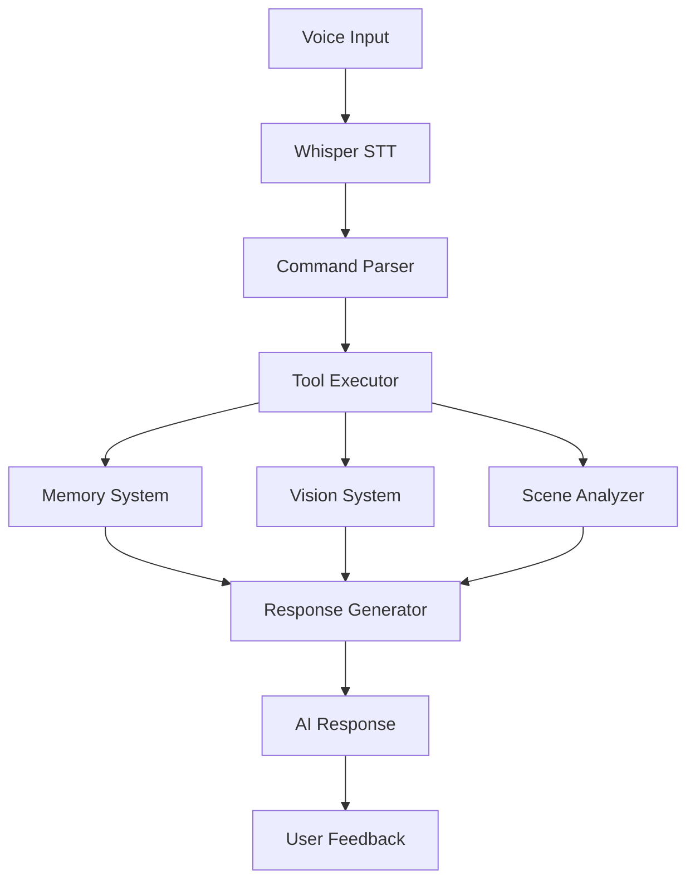

# Voice-Controlled Tools Integration Plan
## Whisper Transcribe Pro + AI Assistant Project

### Executive Summary
This plan outlines the integration of voice-controlled tool execution into Whisper Transcribe Pro by extracting and adapting key features from the AI Assistant Project. The goal is to enable users to control Raspberry Pi tools through natural speech commands, with focus on memory management, picture taking, and scene analysis.

---

## 1. Architecture Overview

### 1.1 System Components



### 1.2 Core Integration Points

| Component | Source Project | Integration Method |
|-----------|---------------|-------------------|
| Speech-to-Text | Whisper Transcribe Pro | Existing infrastructure |
| Command Parser | New Development | NLP-based intent detection |
| Memory System | AI Assistant Project | Extract & adapt context_memory.py |
| Vision System | AI Assistant Project | Extract hailo_interface.py |
| Scene Analysis | AI Assistant Project | Extract fusion_engine components |
| Tool Executor | New Development | Command pattern implementation |

---

## 2. Voice Command Architecture

### 2.1 Command Flow Pipeline

```python
# Simplified flow
transcription -> intent_detection -> parameter_extraction -> tool_execution -> response_generation
```

### 2.2 Intent Categories

#### Photography Commands
- "Take a picture" → `capture_photo()`
- "Take a photo of [object]" → `capture_photo(target=object)`
- "Show me what you see" → `capture_and_analyze()`

#### Scene Analysis Commands
- "What do you see?" → `describe_scene()`
- "Are there any people?" → `detect_specific(class='person')`
- "What's changed?" → `detect_changes()`

#### Memory Commands
- "Remember this" → `save_context()`
- "What did we talk about?" → `recall_conversation()`
- "Forget everything" → `clear_memory()`

#### System Commands
- "Start monitoring" → `enable_monitoring()`
- "Check system status" → `get_status()`
- "Run diagnostics" → `run_diagnostics()`

---

## 3. Module Extraction & Integration

### 3.1 Memory System Integration

#### Files to Extract:
```
ai-assistant-project/
├── core/context_memory.py        # Core memory management
├── src/memory/conversation_memory.py  # SQLite storage
└── config/memory_config.yaml     # Configuration
```

#### Integration Steps:
1. Create `whisper_transcribe_pro/tools/memory/` directory
2. Adapt `ContextMemory` class for voice context
3. Add voice command metadata to memory entries
4. Implement memory persistence between sessions

#### New Memory API:
```python
class VoiceMemory:
    def __init__(self):
        self.context = ContextMemory()
        self.conversations = ConversationMemory()
    
    def remember_command(self, transcription, response, metadata):
        """Store voice command and response with context"""
        
    def recall_context(self, query):
        """Retrieve relevant context for query"""
        
    def get_session_summary(self):
        """Generate summary of current session"""
```

### 3.2 Picture Taking Integration

#### Files to Extract:
```
ai-assistant-project/
├── vision/hailo_interface.py     # Hailo AI interface
├── src/ai_core/vision.py         # Photo capture
└── config/vision_config.yaml     # Configuration
```

#### Integration Steps:
1. Create `whisper_transcribe_pro/tools/vision/` directory
2. Extract photo capture functionality
3. Add voice-triggered capture methods
4. Integrate with existing Hailo detection

#### New Vision API:
```python
class VoiceVision:
    def __init__(self):
        self.hailo = HailoInterface()
        self.camera = CameraController()
    
    async def voice_capture(self, command_params):
        """Capture photo based on voice command"""
        photo_path = await self.camera.capture()
        detections = await self.hailo.detect(photo_path)
        return self.format_response(photo_path, detections)
    
    async def describe_capture(self, photo_path):
        """Generate natural language description"""
```

### 3.3 Scene Analysis Integration

#### Files to Extract:
```
ai-assistant-project/
├── core/fusion_engine.py         # Multi-modal fusion
├── language/llm_interface.py     # LLM integration
└── demos/phase1_demo.py          # Example implementations
```

#### Integration Steps:
1. Create `whisper_transcribe_pro/tools/analysis/` directory
2. Extract scene description logic
3. Add voice-specific context handling
4. Implement change detection for monitoring

#### New Analysis API:
```python
class SceneAnalyzer:
    def __init__(self):
        self.fusion = FusionEngine()
        self.llm = LLMInterface()
        
    async def analyze_scene(self, voice_command):
        """Analyze current scene based on voice request"""
        vision_data = await self.get_vision_data()
        context = self.get_conversation_context()
        return await self.fusion.process(vision_data, context, voice_command)
    
    async def monitor_changes(self, baseline=None):
        """Monitor scene for changes"""
```

---

## 4. Voice Command Parser

### 4.1 Intent Detection System

```python
class VoiceCommandParser:
    def __init__(self):
        self.intents = {
            'photo': ['take', 'picture', 'photo', 'capture', 'snapshot'],
            'scene': ['see', 'look', 'describe', 'what', 'analyze'],
            'memory': ['remember', 'recall', 'forget', 'save'],
            'system': ['status', 'monitor', 'check', 'diagnostic']
        }
        
    def parse_command(self, transcription):
        """Parse transcription to extract intent and parameters"""
        intent = self.detect_intent(transcription)
        params = self.extract_parameters(transcription, intent)
        return Command(intent, params)
    
    def detect_intent(self, text):
        """Detect primary intent from transcription"""
        # NLP-based intent detection
        
    def extract_parameters(self, text, intent):
        """Extract command parameters"""
        # Parameter extraction logic
```

### 4.2 Command Execution Framework

```python
class ToolExecutor:
    def __init__(self):
        self.tools = {
            'photo': VoiceVision(),
            'scene': SceneAnalyzer(),
            'memory': VoiceMemory(),
            'system': SystemControl()
        }
        
    async def execute(self, command):
        """Execute parsed command"""
        tool = self.tools.get(command.intent)
        if tool:
            return await tool.execute(command.params)
        return self.handle_unknown_command(command)
```

---

## 5. File Structure

```
whisper-transcribe-pi/
├── whisper_transcribe_pro.py     # Main application
├── tools/                         # New voice tools module
│   ├── __init__.py
│   ├── command_parser.py         # Voice command parsing
│   ├── tool_executor.py          # Command execution
│   ├── memory/
│   │   ├── __init__.py
│   │   ├── context_memory.py     # Extracted from AI assistant
│   │   ├── voice_memory.py       # Voice-specific memory
│   │   └── storage.py            # SQLite persistence
│   ├── vision/
│   │   ├── __init__.py
│   │   ├── hailo_interface.py    # Extracted Hailo interface
│   │   ├── camera_control.py     # Camera operations
│   │   └── voice_vision.py       # Voice-triggered vision
│   ├── analysis/
│   │   ├── __init__.py
│   │   ├── scene_analyzer.py     # Scene analysis
│   │   ├── fusion_engine.py      # Multi-modal fusion
│   │   └── change_detector.py    # Change monitoring
│   └── config/
│       ├── tools_config.yaml     # Tool configuration
│       └── commands.yaml          # Command definitions
├── tests/
│   └── tools/                     # Tool tests
└── docs/
    └── voice_commands.md          # User documentation
```

---

## 6. Integration API Design

### 6.1 Main Integration Point

```python
# In whisper_transcribe_pro.py

class WhisperTranscribePro:
    def __init__(self):
        # Existing initialization
        self.voice_tools = VoiceToolsManager() if self.settings.get('voice_tools_enabled') else None
    
    def process_transcription(self, text):
        """Process transcribed text"""
        # Existing transcription handling
        
        if self.voice_tools and self.is_command(text):
            response = await self.voice_tools.process_command(text)
            self.display_tool_response(response)
        else:
            # Normal transcription flow
```

### 6.2 Voice Tools Manager

```python
class VoiceToolsManager:
    def __init__(self):
        self.parser = VoiceCommandParser()
        self.executor = ToolExecutor()
        self.memory = VoiceMemory()
        
    async def process_command(self, transcription):
        """Process voice command end-to-end"""
        # Add to memory
        self.memory.add_user_input(transcription)
        
        # Parse command
        command = self.parser.parse_command(transcription)
        
        # Execute tool
        result = await self.executor.execute(command)
        
        # Store result in memory
        self.memory.add_assistant_response(result)
        
        return result
```

---

## 7. Implementation Phases

### Phase 1: Foundation (Week 1)
- [ ] Create feature branch `feature/voice-tools-integration`
- [ ] Set up tools module structure
- [ ] Extract and adapt memory system
- [ ] Implement basic command parser
- [ ] Create tool executor framework

### Phase 2: Core Tools (Week 2)
- [ ] Integrate picture taking functionality
- [ ] Implement scene analysis
- [ ] Add memory commands
- [ ] Create response formatter
- [ ] Basic testing suite

### Phase 3: Advanced Features (Week 3)
- [ ] Implement change detection
- [ ] Add conversation context
- [ ] Create command chaining
- [ ] Performance optimization
- [ ] Error handling & recovery

### Phase 4: Integration & Polish (Week 4)
- [ ] Full integration with Whisper UI
- [ ] Settings UI for voice tools
- [ ] Documentation & examples
- [ ] Performance testing
- [ ] User acceptance testing

---

## 8. Testing Strategy

### 8.1 Unit Tests
```python
tests/tools/
├── test_command_parser.py
├── test_memory_system.py
├── test_vision_tools.py
├── test_scene_analysis.py
└── test_tool_executor.py
```

### 8.2 Integration Tests
```python
tests/integration/
├── test_voice_to_photo.py
├── test_voice_to_memory.py
├── test_voice_to_scene.py
└── test_end_to_end.py
```

### 8.3 Performance Benchmarks
- Command parsing: < 100ms
- Photo capture: < 2s
- Scene analysis: < 3s
- Memory operations: < 50ms
- End-to-end voice command: < 5s

---

## 9. Configuration

### 9.1 Settings Structure
```yaml
voice_tools:
  enabled: true
  command_prefix: null  # Optional prefix like "assistant"
  
  memory:
    max_history: 100
    persistence: true
    database_path: "~/.whisper_voice_memory.db"
    
  vision:
    default_quality: "high"
    save_photos: true
    photo_directory: "~/Pictures/voice_captures"
    
  analysis:
    llm_endpoint: "http://localhost:7860"
    confidence_threshold: 0.5
    enable_monitoring: false
    
  commands:
    custom_commands: []  # User-defined commands
```

---

## 10. Example Voice Interactions

### Photography Session
```
User: "Take a picture"
System: "📸 Photo captured. I see 2 people, 1 laptop, and office furniture."

User: "Save this setup"
System: "✓ Saved current scene configuration to memory."

User: "What changed since last time?"
System: "Comparing to previous capture: One additional person entered, laptop moved to center table."
```

### Memory Interaction
```
User: "Remember that John prefers the window seat"
System: "✓ Noted: John's seating preference saved."

User: "What do you remember about John?"
System: "From our conversations: John prefers the window seat, mentioned earlier today."
```

### Scene Analysis
```
User: "What do you see?"
System: "I can see a desk with a computer monitor, keyboard, coffee mug, and some papers. The room appears to be an office with good lighting."

User: "Are there any people?"
System: "No people are currently visible in the scene."
```

---

## 11. Success Metrics

| Metric | Target | Measurement |
|--------|--------|-------------|
| Command Recognition Rate | > 95% | Successful parse / Total commands |
| Response Time | < 3s | Time from command to response |
| Memory Recall Accuracy | > 90% | Relevant recalls / Total queries |
| Scene Description Quality | > 4/5 | User satisfaction rating |
| System Stability | > 99% uptime | Continuous operation time |

---

## 12. Risk Mitigation

| Risk | Impact | Mitigation Strategy |
|------|--------|-------------------|
| High latency | Poor UX | Async processing, caching, optimization |
| Memory overflow | System crash | Automatic cleanup, size limits |
| Misunderstood commands | Failed execution | Confirmation prompts, fuzzy matching |
| Privacy concerns | User trust | Local processing, clear data policies |
| Resource constraints | Performance | Efficient algorithms, resource monitoring |

---

## 13. Future Enhancements

### Near-term (1-2 months)
- Wake word detection ("Hey Assistant")
- Multi-language support
- Voice feedback/TTS responses
- Command macros/shortcuts

### Long-term (3-6 months)
- Gesture recognition integration
- Multi-user support
- Cloud backup/sync
- Mobile app companion
- Home automation integration

---

## Conclusion

This integration plan provides a comprehensive roadmap for adding voice-controlled tool execution to Whisper Transcribe Pro. By leveraging existing components from the AI Assistant Project and building a robust command framework, we can create a powerful voice-first interface for Raspberry Pi tools while maintaining performance and usability standards.

The modular architecture ensures extensibility, allowing for easy addition of new tools and commands as needs evolve. The phased implementation approach minimizes risk while delivering value incrementally.